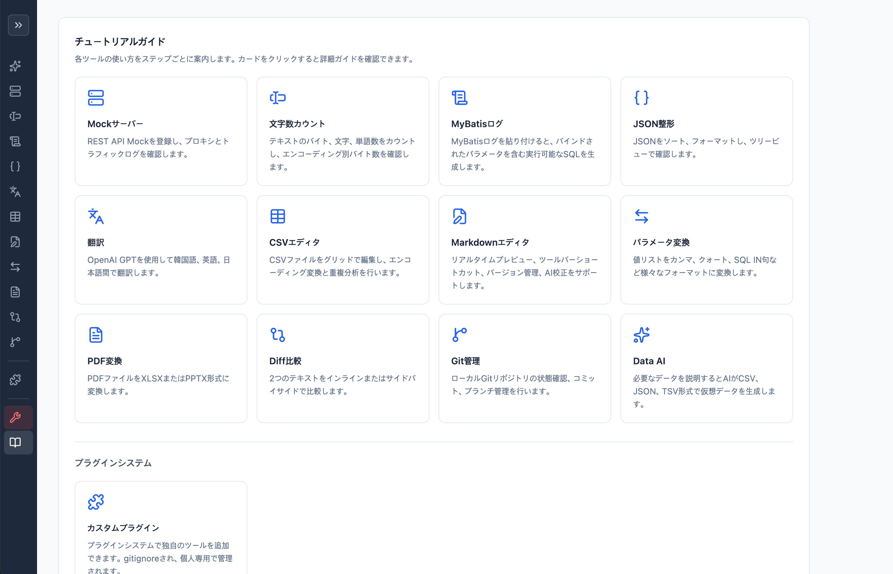

# Personal Dev Tools

ローカルで実行する個人開発ツール集。Python単体サーバーで動作し、ビルド不要でブラウザから利用できます。

## 機能

| ツール | 説明 |
|--------|------|
| Mockサーバー | REST API Mockの登録・プロキシ、トラフィックログ |
| CSVエディタ | CSV編集、エンコーディング変換、重複分析、行/列の追加 |
| Markdown | エディタ＋リアルタイムプレビュー、AI校正、ポップアップ表示、保存/バージョン管理 |
| JSON整形 | JSONソート、フォーマット、ツリービュー |
| 翻訳 | AIベースの多言語翻訳（OpenAI、Gemini、Claude、Grok） |
| MyBatis | MyBatis XML ↔ クエリ変換 |
| 文字数カウント | バイト/文字/単語カウント、エンコーディング別バイト数 |
| Diff比較 | テキスト比較（インライン/サイドバイサイド） |
| PDF変換 | PDF → XLSX、PPTX変換 |
| パラメータ変換 | URLパラメータ ↔ JSON相互変換 |
| Git管理 | ローカルGitリポジトリの状態確認、コミット、ブランチ管理 |
| Data AI | AIベースの仮想データ生成（CSV/JSON/TSV）、DB保存 |
| チュートリアル | 各ツールのステップバイステップ使用ガイド |
| 開発者モード | ツール名変更、DBエクスプローラー、タブ管理、モジュール設定、AI APIキー管理、CDNライブラリ管理 |

## はじめに

### 1. Pythonのインストール

- [python.org/downloads](https://www.python.org/downloads/) からPython 3.10以上をインストールします。
- **Windows**: インストール時に **「Add Python to PATH」** を必ずチェックしてください。
- **macOS**: インストーラをダウンロードして実行します。

### 2. 実行

#### 簡単実行

プロジェクトフォルダ内のランチャーファイルを使用します。

**Windows**
- `start.bat` をダブルクリックします。

**macOS**
- ターミナルを開き、以下のコマンドを入力します：
```bash
cd プロジェクトフォルダのパス
./start.sh
```
- または `start.sh` をターミナルにドラッグしてEnterを押します。

実行するとブラウザが自動的に開きます。

**サーバー停止**: ターミナルで `Ctrl+C` を押すか、ウィンドウを閉じます。

#### 手動実行（開発者向け）

```bash
# 仮想環境の作成
python3 -m venv .venv

# 仮想環境の有効化
source .venv/bin/activate        # macOS / Linux
.venv\Scripts\activate           # Windows

# サーバー起動
python3 server.py                # macOS / Linux
python server.py                 # Windows
```

ブラウザで `http://127.0.0.1:8080` にアクセス。



```bash
# オプション
python3 server.py --port 9090        # ポート変更
python3 server.py --no-open          # ブラウザ自動起動を無効化
```

### 3. AI機能の設定（任意）

翻訳、校正、Data AI機能を使用するにはAI APIキーが必要です。
AI機能を使用しない場合は、この手順はスキップできます。

**対応AIプロバイダー**: OpenAI、Google Gemini、Anthropic Claude、xAI Grok

初回起動時のオンボーディングウィザードでAPIキーを登録するか、後から **DEV > モジュール設定** で登録できます。

### オフライン使用

外部ライブラリを事前ダウンロードすれば、インターネットなしでも使用できます。

1. 開発者モード（DEV）タブ → CDN管理
2. **現在バージョンをダウンロード** または **最新バージョンをダウンロード** をクリック
3. `static/vendor/` に保存され、以降オフラインでも動作

> AI機能（翻訳、校正、Data AI）はAI API接続が必要なため、オフラインでは使用不可

## パッケージ依存関係

以下のパッケージはサーバー初回起動時に自動インストールされます：

| パッケージ | 用途 | 必須 |
|------------|------|------|
| `openai` | OpenAI AI連携 | AI機能使用時 |
| `anthropic` | Claude AI連携 | AI機能使用時 |
| `google-genai` | Gemini AI連携 | AI機能使用時 |
| `xai-sdk` | Grok AI連携 | AI機能使用時 |
| `cryptography` | 開発者モード暗号化 | 開発者モード使用時 |
| `openpyxl` | PDF → XLSX変換 | PDF変換使用時 |
| `python-pptx` | PDF → PPTX変換 | PDF変換使用時 |

> 自動インストールに失敗した場合、手動でインストール: `pip install openai anthropic google-genai xai-sdk cryptography openpyxl python-pptx`

## プロジェクト構造

```
├── server.py           # Pythonサーバー（バックエンド全体）
├── start.sh            # macOS/Linux簡単ランチャー
├── start.bat           # Windows簡単ランチャー
├── static/
│   ├── index.html      # メインページ
│   ├── styles.css      # スタイル
│   ├── app.js          # 共通ロジック
│   ├── *.js            # ツール別クライアントスクリプト
│   └── vendor/         # CDNライブラリローカルキャッシュ（gitignore）
├── dev-tool.db         # SQLiteデータベース（自動生成、gitignore）
├── logs/               # サーバーログ（gitignore）
```

## ログ

サーバーログは `logs/` フォルダに自動生成されます。

- `server.log` — 全ログ（10MBローテーション、バックアップ5個）
- `error.log` — エラーのみ記録

## License

[MIT License](LICENSE)
