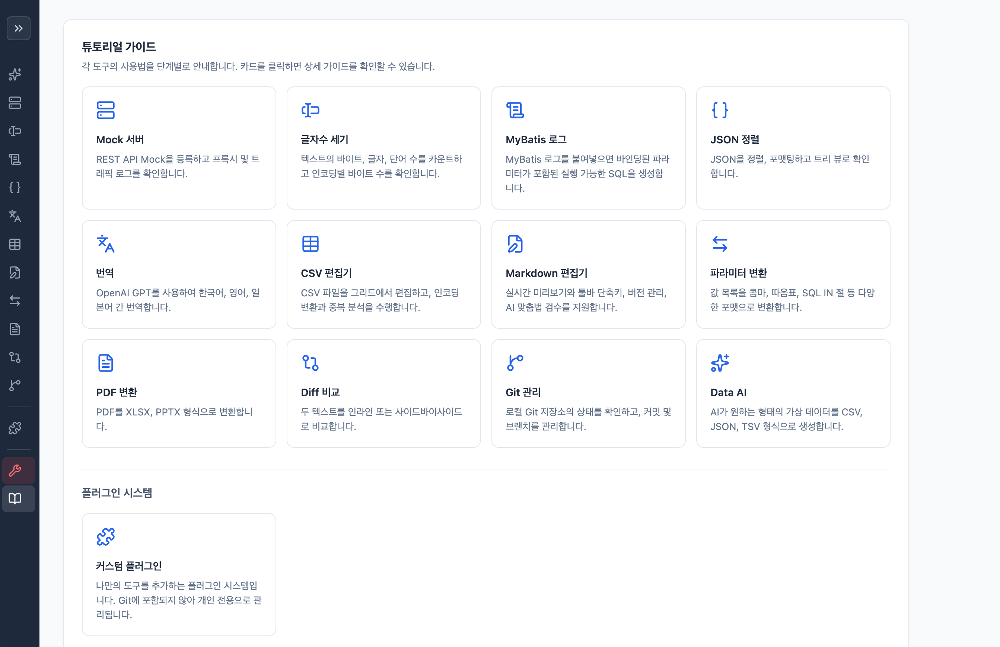

# Personal Dev Tools

[English](README.en.md) | [日本語](README.ja.md)

로컬에서 실행하는 개인 개발 도구 모음. Python 단일 서버로 동작하며, 별도 빌드 과정 없이 브라우저에서 사용합니다.

## 기능

| 도구 | 설명 |
|------|------|
| Mock 서버 | REST API Mock 등록 및 프록시, 트래픽 로그 |
| CSV 편집기 | CSV 편집, 인코딩 변환, 중복 분석, 행/열 추가 |
| Markdown | 에디터 + 실시간 미리보기, AI 맞춤법 검수, 팝업 보기, 저장/버전 관리 |
| JSON 정렬 | JSON 정렬, 포맷팅, 트리 뷰 |
| 번역 | AI 기반 다국어 번역 (OpenAI, Gemini, Claude, Grok) |
| MyBatis | MyBatis XML ↔ 쿼리 변환 |
| 글자수 세기 | 바이트/글자/단어 카운트, 인코딩별 바이트 수 |
| Diff 비교 | 텍스트 비교 (인라인/사이드바이사이드) |
| PDF 변환 | PDF → XLSX, PPTX 변환 |
| 파라미터 변환 | URL 파라미터 ↔ JSON 상호 변환 |
| Git 관리 | 로컬 Git 저장소 상태 확인, 커밋, 브랜치 관리 |
| Data AI | AI 기반 가상 데이터 생성 (CSV/JSON/TSV), DB 저장 |
| Tutorial | 각 도구별 사용법 가이드 |
| 커스텀 플러그인 | `custom/` 디렉토리에 나만의 도구 추가, 표준화된 모듈 규약 |
| 개발자 모드 | 툴 명 변경, DB 탐색기, 탭 관리, 모듈 설정, AI API 키 관리, CDN 라이브러리 관리, 플러그인 관리 |

## 시작하기

### 1. Python 설치

- [python.org/downloads](https://www.python.org/downloads/) 에서 Python 3.10 이상을 설치합니다.
- **Windows**: 설치 시 **"Add Python to PATH"** 체크박스를 반드시 체크하세요.
- **macOS**: 설치 파일 다운로드 후 실행하면 됩니다.

### 2. 실행

#### 간편 실행

이 프로젝트 폴더 안에 있는 실행 파일을 사용합니다.

**Windows**
- `start.bat` 파일을 더블클릭합니다.

**macOS**
- 터미널 앱을 열고, 아래 명령어를 입력합니다:
```bash
cd 프로젝트폴더경로
./start.sh
```
- 또는 터미널에 `./start.sh`를 입력한 뒤 Enter를 누릅니다. (Finder에서 `start.sh`를 터미널로 드래그해도 됩니다)

실행하면 브라우저가 자동으로 열립니다.

**서버 종료**: 실행 중인 터미널 창에서 `Ctrl+C`를 누르거나, 창을 닫으면 됩니다.

#### 수동 실행 (개발자용)

```bash
# 가상 환경 생성
python3 -m venv .venv

# 가상 환경 활성화
source .venv/bin/activate        # macOS / Linux
.venv\Scripts\activate           # Windows

# 서버 실행
python3 server.py                # macOS / Linux
python server.py                 # Windows
```

브라우저에서 `http://127.0.0.1:8080` 접속.



```bash
# 옵션
python3 server.py --port 9090        # 포트 변경
python3 server.py --no-open          # 브라우저 자동 열기 비활성화
```

### 3. AI 기능 설정 (선택)

번역, 맞춤법 검수, Data AI 기능을 사용하려면 AI API Key가 필요합니다.
사용하지 않는다면 이 과정은 건너뛰어도 됩니다.

**지원 AI 프로바이더**: OpenAI, Google Gemini, Anthropic Claude, xAI Grok

첫 실행 시 온보딩 위자드에서 API 키를 등록하거나, 이후 **DEV > 모듈 설정**에서 등록할 수 있습니다.

### 오프라인 사용

외부 라이브러리를 미리 다운로드하면 인터넷 없는 환경에서도 사용할 수 있습니다.

1. 개발자 모드(DEV) 탭 → CDN 관리
2. **현재 버전 다운로드** 또는 **최신 버전 다운로드** 클릭
3. `static/vendor/`에 저장되며, 이후 오프라인에서도 동작

> AI 기능(번역, 검수, Data AI)은 AI API 연결이 필요하므로 오프라인에서 사용 불가

## 패키지 의존성

아래 패키지는 서버 최초 실행 시 자동 설치됩니다:

| 패키지 | 용도 | 필수 여부 |
|--------|------|-----------|
| `openai` | OpenAI AI 연동 | AI 기능 사용 시 |
| `anthropic` | Claude AI 연동 | AI 기능 사용 시 |
| `google-genai` | Gemini AI 연동 | AI 기능 사용 시 |
| `xai-sdk` | Grok AI 연동 | AI 기능 사용 시 |
| `cryptography` | 개발자 모드 암호화 | 개발자 모드 사용 시 |
| `openpyxl` | PDF → XLSX 변환 | PDF 변환 사용 시 |
| `python-pptx` | PDF → PPTX 변환 | PDF 변환 사용 시 |

> 자동 설치가 실패하면 수동으로 설치: `pip install openai anthropic google-genai xai-sdk cryptography openpyxl python-pptx`

## 프로젝트 구조

```
├── server.py              # Python 서버 (전체 백엔드)
├── start.sh               # macOS/Linux 간편 실행
├── start.bat              # Windows 간편 실행
├── static/
│   ├── index.html         # 메인 페이지
│   ├── styles.css         # 스타일
│   ├── app.js             # 공통 로직
│   ├── plugin-loader.js   # 커스텀 플러그인 로더
│   ├── *.js               # 각 도구별 클라이언트 스크립트
│   ├── lang/              # 다국어 번역 파일 (ko, en, ja)
│   └── vendor/            # CDN 라이브러리 로컬 캐시 (gitignore)
├── custom/                # 커스텀 플러그인 디렉토리 (gitignore)
├── custom_template/       # 플러그인 작성 템플릿
├── docs/                  # 문서
│   └── PLUGIN.md          # 플러그인 작성 가이드
├── dev-tool.db            # SQLite 데이터베이스 (자동 생성, gitignore)
├── logs/                  # 서버 로그 (gitignore)
```

### 커스텀 플러그인

나만의 도구를 `custom/` 디렉토리에 추가할 수 있습니다. `.gitignore`에 포함되어 개인 전용으로 관리됩니다.
자세한 내용은 [플러그인 가이드](docs/PLUGIN.md)를 참고하세요.

## 로그

서버 로그는 `logs/` 폴더에 자동 생성됩니다.

- `server.log` — 전체 로그 (10MB 로테이션, 백업 5개)
- `error.log` — 에러만 별도 기록

## License

[MIT License](LICENSE)
